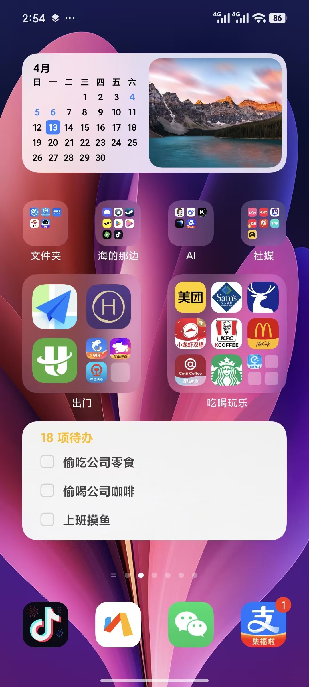

<div align="center">

# MiNote-skill

### 把你的小米代办接入 AI

### 是把小米云笔记待办，变成 AI 和人都能直接调用的能力。

[](#minote-skill)
[](#它是什么)
[](#运行时说明)
[](#当前能力)

</div>

<div align="center">
<br/>

**把你的小米云笔记接入ai agent**

<br/>

**让Ai更靠近你一点**

</div>

---

<div align="center">

你想让 AI 读取你在手机上设置好的待办？

<br/>

你想让 AI 帮你新建管理你的待办然后同步到手机上？

<br/>

你想把小米云笔记接进自己的产品或工作流？ `minote-skill` 直接给你一层可调用封装。

</div>

---

## 它是什么？

在此之前，我们手搓过一个针对小米云笔记的底层驱动：[`minote-driver`](https://github.com/Thetaio-Technology/MiNote-driver)。它确实能把事干成，但仓库里塞满了 Python 源码和繁琐的浏览器驱动配置，过于硬核。如果直接拿它去接 AI 应用，实在太重了。

为了 AI Agent 能轻松接管，我们开坑了 `minote-skill`。

简单来说，它俩的分工是这样的：
> ⚙️ **`minote-driver`** 负责在底层啃硬骨头，**把事做成**。
>
> 🪄 **`minote-skill`** 负责在上层做封装，**让这事更好调用**。

---

## 当前能力

无缝接入 HyperOS 生态，将小米系统自带便签转化为 AI Agent 的外围组件。

目前对可以实现对待办（Todo）的完整控制流：

- **读取检索**：获取未完成待办 / 检索已完成待办
- **写入与编辑**：创建新待办 / 修改待办标题
- **状态流转**：标记完成 / 恢复已完成待办
- **清理删除**：彻底移除待办

🔒 **【硬性约束：不支持私密笔记】**
现在不支持，以后也绝不计划支持。你的私密笔记数据只属于你，这是不容妥协的底线。

## 快速安装

如果你已有 Python 环境，只需 5 步即可完成部署：

**1. 克隆仓库**

```
git clone 本仓库
```

**2. 准备配置** 复制一份环境变量模板，并根据文件内的中文注释修改你的本地路径：

```
cp .env.example .env
```

**3. 安装核心依赖**

```
pip install selenium
```

**4. 下载浏览器驱动** 

下载与你本地 Chrome 浏览器版本匹配的 `chromedriver.exe`，并将其放置到script目录： `script/bin/chromedriver.exe`

**5. 首次登录授权** 运行以下脚本，完成小米云服务的首次登录（扫码或密码验证）：

```
python script/cli/open_mi_cloud.py
```

> 💡 **新手提示（小白专属通道）：
>
> 如果你之前从未折腾过 Python、Selenium 或环境变量
>
> 请**直接放弃上面的步骤**，跳转阅读 👉 **[`install.md`](./install.md)。
>
> 我们在里面为你准备了一套保姆级教程

## 关于小米云笔记（MiNote）

我的手机上常年存放着小米的便签板，因为 HyperOS 支持把这些常用的系统应用组件放到手机桌面作为一个小组件，我就在思考，有没有办法把这个小组件接入 Claude Code、OpenCode 呢？



## 仓库内容

这个仓库是 skill-facing 仓库，主要包含：

- `README.md`：展示页和定位说明
- `install.md`：运行环境要求和安装教程
- `SKILL.md`：顶层 skill 定义
- `script/`：本地运行层和执行入口
- `skills/minote-todo/SKILL.md`：具体能力包定义
- `skills/minote-todo/interface.md`：接口契约
- `skills/minote-todo/examples.md`：调用示例
- `skills/minote-todo/checklist.md`：执行检查项

## 运行时说明

`minote-skill` 现在内置一份本地运行层，真实执行入口位于 `script/`。

该仓库用于集中提供 `minote-skill` 的能力说明、集成文档与机器可读清单，并作为与 [`minote-driver`](https://github.com/Thetaio-Technology/MiNote-driver) 对应发布的 skill 仓库，支持在单一仓库内完成安装、配置与执行。

如果你需要真实执行开发debug以及了解更多项目安装细节，请先阅读：`install.md`

