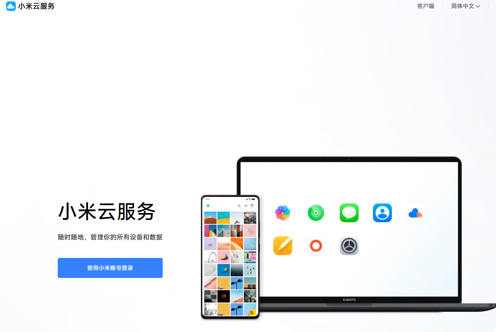

# 安装说明

## 概述

`minote-skill` 现在自带一份位于 `script/` 下的本地运行层。

如果你希望这个 skill 在本地真实执行小米云笔记待办操作，需要先完成运行环境配置，并正确填写仓库根目录下的 `.env` 文件。

整体流程如下：

1. 克隆 `minote-skill`
2. 从 `.env.example` 创建 `.env`
3. 填写 Chrome、ChromeDriver 和运行层路径
4. 安装 Python 依赖
5. 初始化本地登录态
6. 运行验证脚本

## 环境要求

安装流程默认基于以下环境：

- Windows
- Python 3.9+
- 已安装 Google Chrome
- 已准备与当前 Chrome 版本匹配的 `chromedriver.exe`
- 可以访问 `https://i.mi.com/note/#/`
- 至少可以手动登录一次小米账号

## 仓库内容

`minote-skill` 仓库主要包含以下内容：

- skill 定义
- 集成接口约定
- 调用示例
- 安装文档
- 位于 `script/` 下的本地运行层

## 安装步骤

### 1. 克隆 `minote-skill`

将仓库克隆到本地：

```bash
git clone https://github.com/Thetaio-Technology/MiNote-skill.git
cd minote-skill
```

### 2. 创建 `.env`

复制 `.env.example` 为 `.env`。在配置过程中，请始终以 `.env.example` 作为环境变量字段和行内注释的权威来源。

示例：

```bash
copy .env.example .env
```

随后根据 `.env.example` 中的中文注释逐项修改 `.env`。

规则：

- 以 `.env.example` 为唯一权威模板
- 优先使用 `.env.example` 里已经给出的相对路径
- 仅在调试模式或临时指向外部 `minote-driver` 仓库时，才改为绝对路径

### 3. 安装 Python 依赖

如需隔离本地依赖，建议先创建并激活虚拟环境。

安装 Selenium：

```bash
pip install selenium
```

### 4. 准备 Chrome 和 ChromeDriver

下载并安装 Chrome 浏览器。目前仍然需要浏览器作为中间层与小米云服务交互。

Chrome 下载地址：<https://www.google.com/intl/zh-CN/chrome/>

Chrome 可以安装到本机任意位置，但需要记录 `chrome.exe` 的实际路径，并将其填写到 `.env` 中。

然后下载一个与你本地 Chrome 版本匹配的 `chromedriver.exe`。

ChromeDriver 下载地址：<https://developer.chrome.google.cn/docs/chromedriver/downloads?hl=zh-cn>

把它放到：

```text
minote-skill/script/bin/chromedriver.exe
```

说明：

- `chromedriver.exe` 是运行时必需文件
- 它不会被提交到仓库中
- 如果版本和 Chrome 不匹配，浏览器启动可能失败
- 如果 `script/bin/` 目录还不存在，需要你先手动创建

### 5. 校验本地运行环境

首次执行前，请先确认以下条件均已满足：

- Chrome 已安装在正确位置
- `script/bin/chromedriver.exe` 已存在
- Python 能正常导入 `selenium`

运行内置环境检查脚本：

```bash
python script/cli/check_runtime.py
```

它会检查：

- `.env` 是否存在
- 配置中的路径是否能正确解析
- Chrome 是否存在
- ChromeDriver 是否存在
- 配置的用户数据目录父路径是否存在

### 6. 初始化登录态

在 `minote-skill` 仓库根目录执行：

```bash
python script/cli/open_mi_cloud.py
```

该命令会在启动 Chrome 之前自动执行运行环境校验。

如果环境配置不正确，命令会输出与 `python script/cli/check_runtime.py` 相同的结构化检查结果，并直接退出，不会启动浏览器。

如果校验通过，命令会使用项目本地浏览器配置启动 Chrome。

首次使用时：

1. 登录小米账号。

   

   

2. 根据页面提示完成私人设备认证，并收发验证码完成校验。

3. 登录完成并确认登录态已保存后，关闭浏览器。

后续执行将复用这份本地登录态。

### 7. 验证运行能力

仍然在 `minote-skill` 仓库根目录执行：

```bash
python script/verify/verify_todo_crud.py
python script/verify/verify_commands.py
```

如果两个脚本均通过，说明本地运行层已经具备支撑 skill 级集成的能力。

## 如何使用 `minote-skill`

当本地运行层配置完成后，即可按照本仓库定义的 skill 协议执行对应能力。

典型执行入口：

```bash
python script/cli/run_skill.py minote-todo create --title "明天下午买咖啡豆"
```

注意：

- 这个命令需要在 `minote-skill` 仓库根目录执行
- 运行时配置通过 `.env` 解析

如需查看 `cli/run_skill.py` 的更完整参数说明，请参考 `MiNote-driver` 仓库中的相关文档：<https://github.com/Thetaio-Technology/MiNote-driver>

## 常见安装问题（Q&A）

### Chrome 能打开，但自动化失败

常见原因：

- Chrome 和 ChromeDriver 版本不匹配，建议手动安装匹配的版本
- 页面 DOM 发生变化，项目没有及时更新适配的 DOM 结构
- 本地登录态缺失或过期

### 第一次能登录，后续命令又失败

常见原因：

- 会话失效
- 小米侧要求重新验证，在登录时必须选择“这是我的私人设备”，否则后续可能继续触发口令验证
- 本地浏览器配置目录被改动或删除

### 仓库克隆下来了，但什么也执行不了

常见原因：

- 缺少 `.env`
- `.env` 里的路径配置错误
- 缺少 `script/bin/chromedriver.exe`
- 没有安装 `selenium`

## 目录结构

典型本地目录结构如下：

```text
E:\Code\TEMScript\Minote-skill\
├── .env 
├── install.md
├── skills\
└── script\
    ├── cli\
    ├── src\
    ├── verify\
    ├── bin\
    └── chrome_profile\
```
